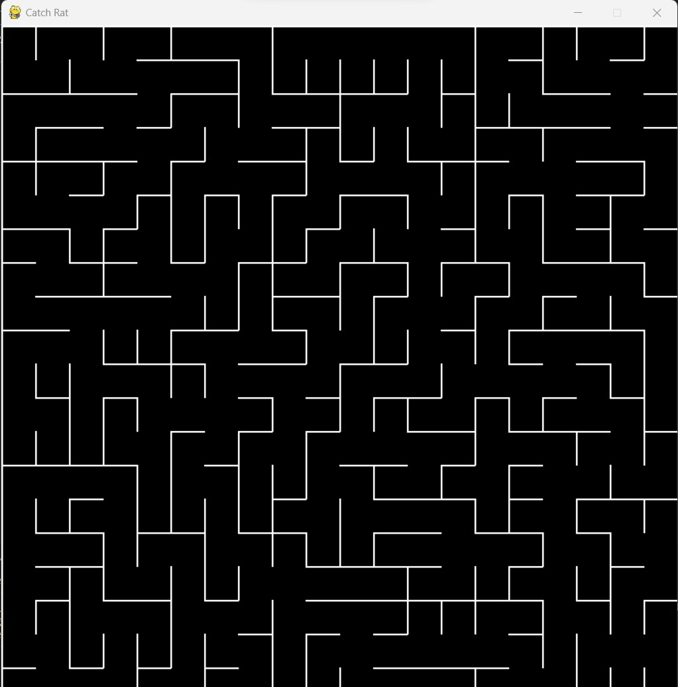
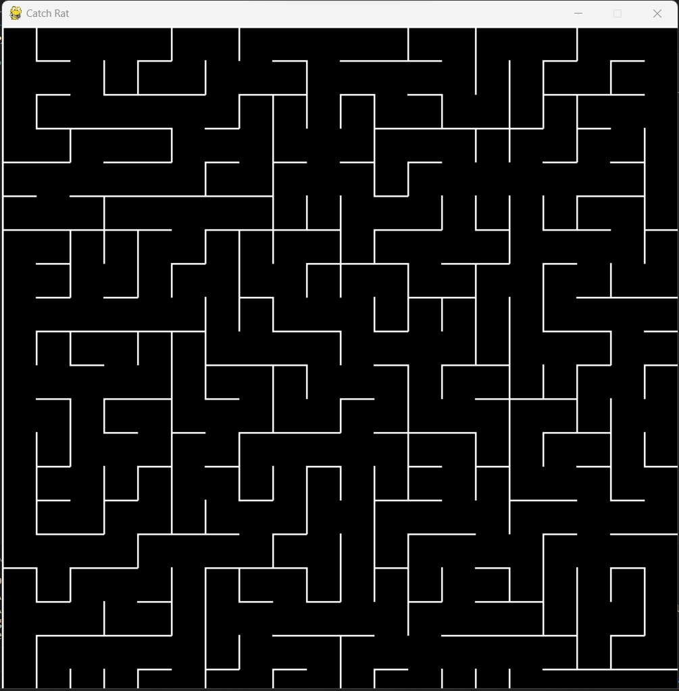
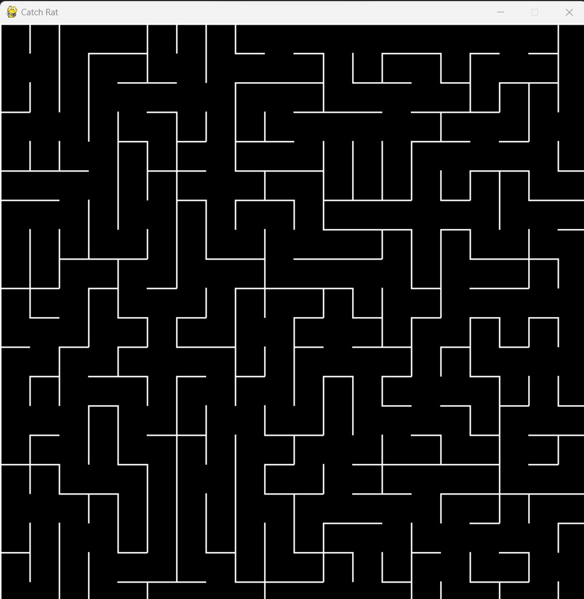

# Catch Rat

**Número da Lista**: 10 
**Conteúdo da Disciplina**: Grafos2 

## Alunos
|Matrícula | Aluno |
| -- | -- |
| 20/0043536  |  Silas Neres de Souza|
| 20/2017521  |  Algusto Rodrigues Caldas |

## Sobre 
Gerador de labirintos aleatórios.

## Screenshots

Labirinto 1

Labirinto 2

Labirinto 3

## Instalação 
**Linguagem**: Python 
**Framework**: Pygame e Numpy 
Necessário ter uma versão atualizada da linguagem Python (Preferência 3.10) e, além disso, instalar o framework Pygame e Numpy (Use o comando: pip install). 

## Uso 
Basta dar run no código para que seja possível gerar um novo mapa aleatório.

## Outros 
None
