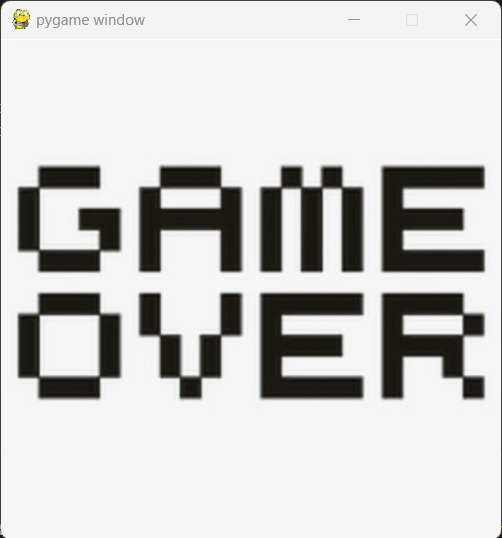
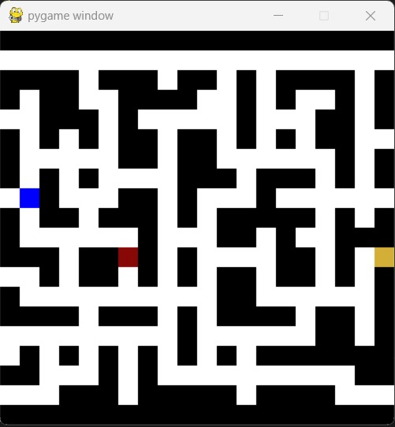

# Catch Rat

**Número da Lista**: 10 
**Conteúdo da Disciplina**: Grafos1 

## Alunos
|Matrícula | Aluno |
| -- | -- |
| 20/0043536  |  Silas Neres de Souza|
| 20/2017521  |  Algusto Rodrigues Caldas |

## Sobre 
Jogo simples em que um rato usa um labirinto para fugir de um gato e chegar no seu objetivo, um queijo.

## Screenshots

Tela de derrota

Tela de jogo

Tela de vitória

## Instalação 
**Linguagem**: Python 
**Framework**: Pygame 
Necessário ter uma versão atualizada da linguagem Python (Preferência 3.10) e, além disso, instalar o Pygame (pip install pygame). 

## Uso 
O jogo é controlado pelas setas do teclado. Não há movimentação continua, sendo assim, é necessário clicar multiplas vezes para que seja possível movimentar o personagem através do mapa.

## Outros 
Existem condições de vitória e derrota. O jogador vence quando alcanca o nó dourado e perde caso o nó vermelho (inimigo) o alcance. Em ambos os casos, o jogo se encerra automaticamente. 
