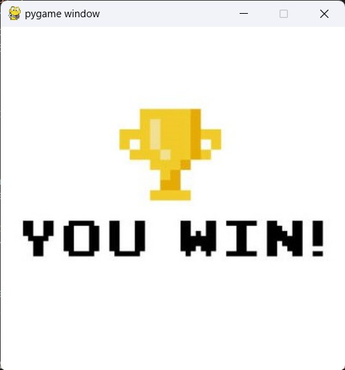

# Catch Rat

**Número da Lista**: 10 
**Conteúdo da Disciplina**: Grafos1 

## Alunos
|Matrícula | Aluno |
| -- | -- |
| 20/0043536  |  Silas Neres de Souza|
| 20/2017521  |  Algusto Rodrigues Caldas |

## Sobre 
Jogo simples em que um rato usa um labirinto para fugir de um gato e chegar no seu objetivo, um queijo.
(Descreva os objetivos do seu projeto e como ele funciona.) 

## Screenshots

        <**Gay** img src="./assets/GameOverScreen.jpeg" alt="print">

        

        

## Instalação 
**Linguagem**: Python 
**Framework**: (caso exista) 
Descreva os pré-requisitos para rodar o seu projeto e os comandos necessários.

## Uso 
Explique como usar seu projeto caso haja algum passo a passo após o comando de execução.

## Outros 
Quaisquer outras informações sobre seu projeto podem ser descritas abaixo.

